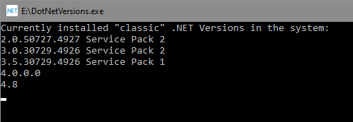

# DotNetVersions

There's no simple built in way to see the currently installed versions of the "classic" .NET platform in a system. The only way is to [go to the system's registry and search and analyze some keys and values](https://docs.microsoft.com/en-us/dotnet/framework/migration-guide/how-to-determine-which-versions-are-installed).

This simple and straight-forward command-line tool shows all the available versions in your system.

>**Note**: I've used .NET 2.0 for this tool, the minimum version I had access to, so that it can really work in any system, even the oldest ones, and being able to return all the versions available anyway.

By default, it shows some informational text at the beginning, and stops the execution until you press any key:



This is useful for informational purposes, but if for any reason you need to run it in a batch file and get just the versions without stopping execution, you can use the `/b`, `-b` or `--b` switch :

```bash
dotnetversions -b
```

You can get some quick help by using the `/?`, `-?`, `--?`, `/help`, `-help`, or `--help` switch.
